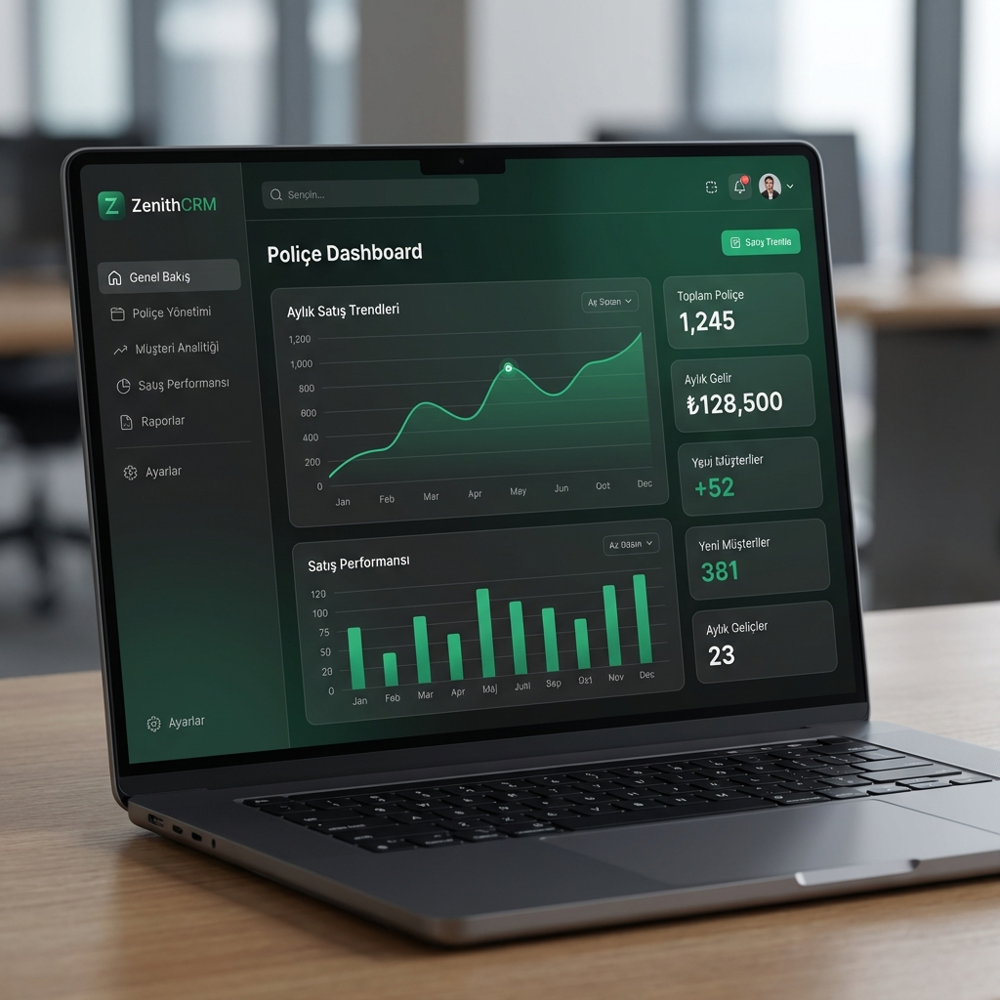
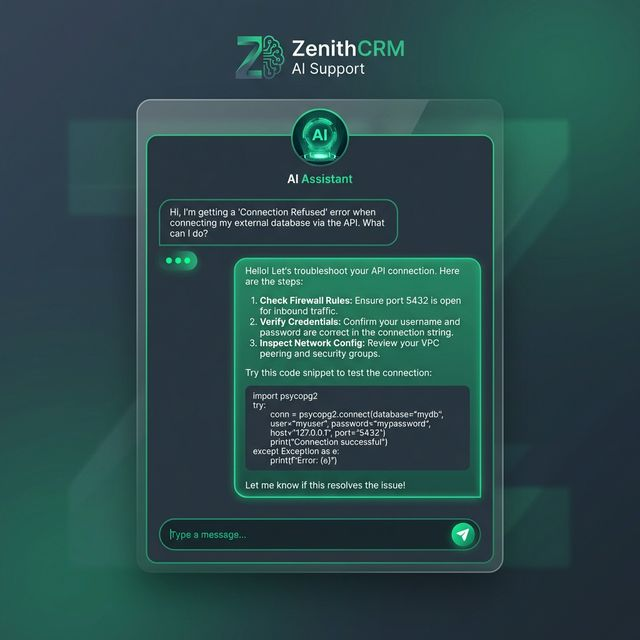
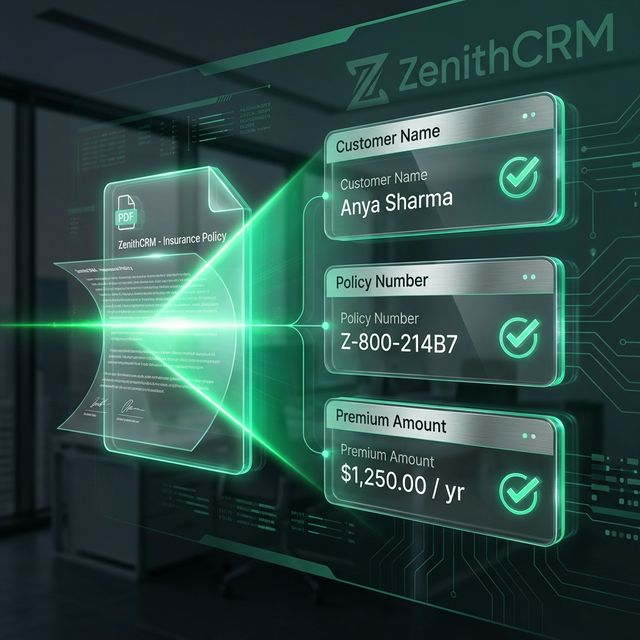
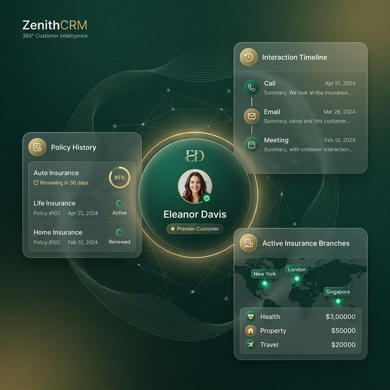

# ZenithCRM: Yeni Nesil Sigorta Acente Yönetim Sistemi
## Teknik Tanıtım ve Özellik Belgesi

### 1. Giriş
ZenithCRM, modern sigorta acentelerinin ihtiyaç duyduğu hız, güvenlik ve analitik gücü tek bir platformda birleştiren kapsamlı bir SaaS (Software as a Service) çözümüdür. Geleneksel yöntemlerin ötesine geçerek, yapay zeka ve otomasyon teknolojileriyle acente verimliliğini %40'a kadar artırmayı hedefler.

---

### 2. Temel Teknolojik Özellikler

#### 🤖 AI Destekli Teknik Asistan
*   **Akıllı Teşhis:** Sistem hatalarını ve kullanıcı sorunlarını gerçek zamanlı analiz eden Google Gemini destekli asistan.
*   **Anlık Çözüm:** Kullanıcılara teknik dökümantasyon beklemeksizin adım adım rehberlik eder.

#### 📄 Gelişmiş OCR (Optik Karakter Tanıma)
*   **Otomatik Poliçe Okuma:** PDF formatındaki poliçeleri saniyeler içinde tarar ve müşteri/prim bilgilerini otomatik olarak sisteme işler.
*   **Sıfır Manuel Hata:** Veri giriş hızını artırırken, insan kaynaklı hataları minimuma indirir.

#### 📊 Analitik ve İş Zekası (BI)
*   **Derinlemesine Raporlama:** Branş bazlı ciro analizi, personel performans ligi ve hedef takibi.
*   **Yıllık Kıyaslama:** Mevcut yılın verilerini önceki yıllarla otomatik kıyaslayarak büyüme trendlerini gösterir.

---

### 3. Sistem Mimarisi ve Güvenlik

#### 🏢 Multi-tenant (Çoklu Kiracı) Yapısı
*   **Müşteri 360:** Müşterinin tüm geçmişi, poliçeleri ve belgeleri tek bir ekranda.

#### 🛡️ Güvenlik Katmanları
*   **Uçtan Uca Şifreleme:** Tüm kullanıcı verileri ve şifreler endüstri standartlarında (BCrypt) şifrelenmektedir.
*   **JWT Tabanlı Kimlik Doğrulama:** Güvenli oturum yönetimi ve yetki seviyeleri.

*   **Audit Logging:** Sistem üzerinde yapılan tüm kritik işlemler (silme, güncelleme) denetim amaçlı kayıt altına alınır.

#### 💻 Teknoloji Yığını (Tech Stack)
*   **Frontend:** React, TypeScript, Tailwind CSS, Lucide Icons.
*   **Backend:** Node.js, Express, Prisma ORM.
*   **Veritabanı:** PostgreSQL (Supabase Altyapısı).

---

### 4. İş Akışı ve Kullanıcı Deneyimi
1.  **Hızlı Kayıt:** 15 saniye içinde acente kurulumu ve otomatik branş yapılandırması.
2.  **Müşteri 360:** Müşterinin tüm geçmişi, poliçeleri ve belgeleri tek bir ekranda.
3.  **Mobil Entegrasyon:** QR kod desteği ile masaüstünden WhatsApp/Arama üzerinden müşteriye anında erişim.

---

### 5. Sonuç
ZenithCRM, sadece bir kayıt tutma aracı değil; sigorta acentenizi geleceğe taşıyan dijital bir iş ortağıdır. Düşük operasyonel maliyet, yüksek veri güvenliği ve yapay zeka desteğiyle acentenizi bir adım öne taşır.

---
*© 2024 ZenithCRM - Tüm Hakları Saklıdır.*
