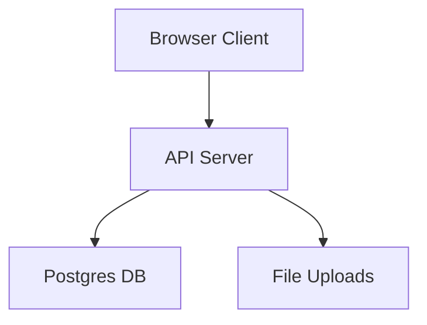

# ZenithCRM Threat Model

## Executive summary
ZenithCRM is a multi-tenant CRM exposed to the public internet with cookie-based auth, a Postgres datastore, and file uploads. The highest risks are cross-tenant or cross-branch data access due to authorization gaps, session compromise (cookie theft/CSRF/token leakage), and abuse of file upload and report endpoints for data exposure or availability impact. These risks are amplified by 100+ user scale and multi-branch tenants, while existing controls (auth middleware, CSRF, rate limits, file size/type limits, CSP) reduce but do not eliminate them.

## Scope and assumptions
- In-scope paths: `server/src`, `server/prisma`, `client/src`.
- Out-of-scope: CI/CD, hosting platform controls (Vercel/Railway/Supabase), mobile clients, and third-party integrations not present in repo.
- Assumptions:
  - App is reachable from the public internet; users may connect from home.
  - Authn is email + password only; no SSO/MFA.
  - Data currently low sensitivity but may include customer identity/contact/financial details later.
  - Multi-tenant with branch-level data segregation; single-branch tenants should not expose branch management.
  - Cookie-based auth with CSRF protection is in use. Evidence: `server/src/middleware/auth.middleware.ts`, `server/src/middleware/csrf.middleware.ts`, `client/src/main.tsx`.

Open questions that could change risk ranking:
- Is there an admin-only backoffice or support impersonation flow not in this repo?
- Are audit logs used for detection in production, and where are they stored?
- Is there a WAF/CDN or edge rate limiting beyond application-level controls?

## System model
### Primary components
- **Web client (React/Vite)**: Browser UI sending API requests with cookies and CSRF header. Evidence: `client/src/main.tsx`.
- **API server (Express)**: REST API, cookie sessions, CSRF, CORS, rate limiting, CSP. Evidence: `server/src/app.ts`, `server/src/middleware/auth.middleware.ts`, `server/src/middleware/csrf.middleware.ts`.
- **Database (PostgreSQL via Prisma)**: Multi-tenant entities (Tenant/Branch/User/Customer/Sale/Document, etc.). Evidence: `server/prisma/schema.prisma`, `server/src/prisma.ts`.
- **File storage (local uploads)**: Document uploads stored on disk and served from `/uploads`. Evidence: `server/src/app.ts`, `server/src/routes/document.routes.ts`, `server/src/middleware/upload.middleware.ts`.

### Data flows and trust boundaries
- **Browser → API Server (public internet)**  
  - Data: credentials, session cookies, CSRF tokens, tenant/branch scoped business data.  
  - Channel: HTTPS (assumed for production).  
  - Security: cookie auth + JWT verification (`auth.middleware`), CSRF checks (`csrf.middleware`), CORS allowlist (`app.ts`), rate limits in production (`app.ts`).  
  - Validation: JSON parsing and per-controller validation (varies).  
  - Evidence: `server/src/app.ts`, `server/src/middleware/auth.middleware.ts`, `server/src/middleware/csrf.middleware.ts`.

- **API Server → Postgres (trusted internal network)**  
  - Data: all tenant, user, customer, sales, commission, message, notification data.  
  - Channel: DB connection via Prisma.  
  - Security: DB credentials from env; Prisma query layer; no row-level security in schema.  
  - Evidence: `server/prisma/schema.prisma`, `server/src/prisma.ts`.

- **API Server → File System (uploads)**  
  - Data: customer documents, PDFs/images.  
  - Channel: local disk write/read.  
  - Security: multer file size/type limits; file names randomized.  
  - Evidence: `server/src/routes/document.routes.ts`, `server/src/middleware/upload.middleware.ts`, `server/src/app.ts`.

#### Diagram

## Assets and security objectives
| Asset | Why it matters | Security objective (C/I/A) |
|---|---|---|
| Tenant/branch data | Cross-tenant leakage is critical business risk | C/I |
| User credentials & sessions | Account takeover risk | C/I |
| Customer records, sales, commissions | Business integrity and privacy | C/I |
| Documents (PDF/images) | Potential PII exposure | C |
| Audit logs | Detection/forensics | I/A |
| Availability of API | Core operations for 100+ users | A |

## Attacker model
### Capabilities
- Remote attacker with internet access to the API and web UI.
- Can attempt credential stuffing, brute force, and CSRF against logged-in users.
- Can upload files within allowed types/size.

### Non-capabilities
- No direct access to database or server filesystem.
- No assumed insider/admin access.
- No assumed ability to alter deployed binaries or infrastructure.

## Entry points and attack surfaces
| Surface | How reached | Trust boundary | Notes | Evidence (repo path / symbol) |
|---|---|---|---|---|
| Auth endpoints | `/api/auth/*` | Internet → API | Login, register, password reset | `server/src/routes/auth.routes.ts` |
| Tenant/branch/user management | `/api/tenants`, `/api/branches`, `/api/users` | Internet → API | High-impact admin operations | `server/src/routes/tenant.routes.ts`, `server/src/routes/branch.routes.ts`, `server/src/routes/user.routes.ts` |
| Customer & sales | `/api/customers`, `/api/sales` | Internet → API | Core business data | `server/src/routes/customer.routes.ts`, `server/src/routes/sale.routes.ts` |
| Documents | `/api/documents/upload` | Internet → API | File upload; stored on disk | `server/src/routes/document.routes.ts`, `server/src/middleware/upload.middleware.ts` |
| Reports/analytics | `/api/reports`, `/api/analytics` | Internet → API | Potential bulk data exposure | `server/src/routes/report.routes.ts`, `server/src/routes/analytics.routes.ts` |
| OCR | `/api/ocr` | Internet → API | File parsing pipeline | `server/src/routes/ocr.routes.ts`, `server/src/controllers/ocr.controller.ts` |
| Session management | `/api/sessions` | Internet → API | Admin revocation/list | `server/src/routes/session.routes.ts` |
| Static uploads | `/uploads/*` | Internet → API | Direct file access | `server/src/app.ts` |

## Top abuse paths
1. **Cross-tenant data access** → attacker obtains valid credentials for tenant A → crafts API requests for tenant B IDs → unauthorized read/write of customers/sales.  
2. **Cross-branch overreach** → branch user accesses another branch’s sales/documents → unauthorized disclosure or edits.  
3. **Session theft** → attacker steals cookie/refresh token (XSS or device compromise) → replays token to access tenant data.  
4. **CSRF on state-changing endpoints** → victim logged in → attacker triggers POST/DELETE without valid CSRF → unauthorized actions.  
5. **File upload abuse** → attacker uploads malicious or oversized files (within limits) → storage exhaustion or malware propagation.  
6. **Brute force/credential stuffing** → repeated login attempts → account takeover if rate limits/bot defenses are insufficient.  
7. **Excessive data exposure via reports** → attacker with low privilege calls report endpoints → large data export.  
8. **Error/info leakage** → stack traces or error messages reveal internal details → aids exploitation.

## Threat model table
| Threat ID | Threat source | Prerequisites | Threat action | Impact | Impacted assets | Existing controls (evidence) | Gaps | Recommended mitigations | Detection ideas | Likelihood | Impact severity | Priority |
|---|---|---|---|---|---|---|---|---|---|---|---|---|
| TM-001 | Internet attacker | Valid account (stolen or low-privilege) | Access other tenant/branch data by ID tampering | Cross-tenant data leakage | Tenant data, customer/sales records | Auth middleware verifies JWT (`server/src/middleware/auth.middleware.ts`) | Per-entity tenant/branch checks must be consistent across controllers | Enforce tenantId/branchId filters at query layer; add authorization helpers; add tests | Log denied access with tenant/user context | Medium | High | High |
| TM-002 | External attacker | None or stolen session | CSRF on state-changing endpoints | Unauthorized changes | Sales, customers, commissions | CSRF cookie/header check (`server/src/middleware/csrf.middleware.ts`) | CSRF skipped on some auth endpoints; ensure all mutating routes enforce CSRF | Apply CSRF to all mutating routes and confirm client sends header | CSRF failure metrics; anomaly detection for POSTs | Low | Medium | Medium |
| TM-003 | Credential stuffer | Auth endpoints accessible | Brute force login | Account takeover | Credentials, tenant data | Login rate limit in production (`server/src/app.ts`) | No MFA; potential weak password policy | Add MFA/2FA option; strengthen password policy; consider CAPTCHA after failures | Alert on repeated failed logins | Medium | High | High |
| TM-004 | Malicious user | Authenticated | Upload malicious file or attempt path abuse | Malware storage or data exposure | Documents, system availability | Multer file size/type limits (`server/src/routes/document.routes.ts`, `server/src/middleware/upload.middleware.ts`) | Static serving of uploads; no malware scanning | Add malware scanning; store uploads outside web root; signed URLs | Monitor upload volume and file types | Medium | Medium | Medium |
| TM-005 | Internet attacker | Session token theft | Replay access/refresh tokens | Full account takeover | Sessions, tenant data | httpOnly cookies + refresh rotation (`server/src/controllers/auth.controller.ts`) | Tokens stored in DB; leaks increase impact | Bind refresh tokens to device; rotate on use; shorten TTL for non-remember | Monitor token reuse and rapid token issuance | Low | High | Medium |
| TM-006 | Low-privilege user | Authenticated | Use report/analytics endpoints to exfiltrate data | Bulk data exposure | Customer/sales data | Auth middleware (`server/src/middleware/auth.middleware.ts`) | Role/tenant scoping in reports must be consistent | Enforce role-based access and tenant scoping; limit export scope | Alert on large report exports | Medium | High | High |
| TM-007 | External attacker | None | Abuse public uploads URL for enumeration | Document metadata exposure | Documents | Auth on upload/read via routes | Direct `/uploads` static path allows guessing | Remove static serving or add auth gateway; randomize paths | Track 404/403 on /uploads | Low | Medium | Low |
| TM-008 | External attacker | None | Trigger error paths for info leak | Recon assists exploitation | Internal details | Error handler present (`server/src/app.ts`) | Error responses include raw messages | Sanitize error messages; hide stack traces | Track error spikes by route | Medium | Low | Low |

## Criticality calibration
- **Critical**: cross-tenant data access at scale; auth bypass allowing any user to access all tenants.
- **High**: account takeover at scale; report endpoints leaking large tenant datasets.
- **Medium**: file upload abuse causing storage/availability issues; CSRF causing unauthorized edits for a tenant.
- **Low**: minor info leaks or noisy DoS with easy mitigation.

## Focus paths for security review
| Path | Why it matters | Related Threat IDs |
|---|---|---|
| `server/src/middleware/auth.middleware.ts` | Authn and request user context | TM-001, TM-003, TM-005 |
| `server/src/controllers/*.ts` | Authorization checks across entities | TM-001, TM-006 |
| `server/src/routes/document.routes.ts` | Upload entry point and access controls | TM-004, TM-007 |
| `server/src/middleware/upload.middleware.ts` | File type/size limits | TM-004 |
| `server/src/middleware/csrf.middleware.ts` | CSRF enforcement | TM-002 |
| `server/src/app.ts` | CORS, CSP, rate limiting, static uploads | TM-002, TM-003, TM-007, TM-008 |
| `server/prisma/schema.prisma` | Multi-tenant data model | TM-001 |
| `client/src/main.tsx` | CSRF header & cookie usage | TM-002, TM-005 |

## Notes on use
- This model assumes public internet access; risk ranking would drop if restricted to VPN-only access.
- If/when sensitive customer/financial/health data is added, increase severity for any data exposure threats.
- Multi-tenant and multi-branch rules are the highest-priority authorization focus across controllers.
